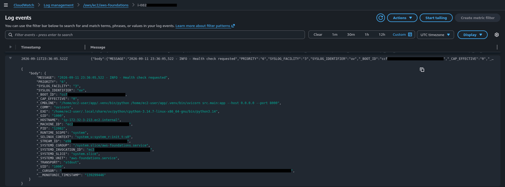
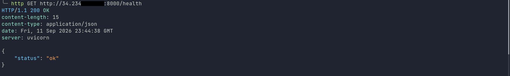
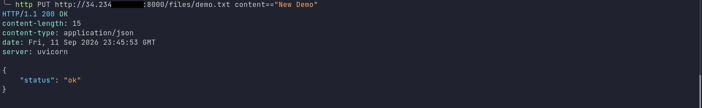
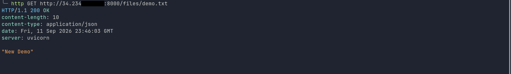

# AWS Foundations

A hands-on AWS foundations project focused on building, managing, and automating cloud infrastructure using AWS services, AWS CLI, Terraform, and a local AWS environment with Floci.

The project follows a **local-first approach**: infrastructure and application components are developed and tested locally before being deployed to real AWS.

## Project Goals

* Learn and practice core AWS infrastructure concepts.
* Manage AWS resources through AWS CLI, and Infrastructure as Code.
* Use Terraform to create reproducible infrastructure.
* Deploy and run a backend application on EC2.
* Integrate Amazon S3 for application file storage.
* Configure the CloudWatch Agent to centralize EC2 application logs in CloudWatch Logs.
* Apply IAM roles and Security Groups following the principle of least privilege.
* Understand the differences between local AWS emulation and real AWS infrastructure.

## Architecture

### Application Architecture


More details about the Architecture are available in:

* [`docs/architecture.md`](docs/architecture.md)

### Infrastructure

The project uses the following AWS components:

| Service         | Purpose                                       |
| --------------- | --------------------------------------------- |
| EC2             | Hosts the backend application                 |
| S3              | Stores application files                      |
| IAM             | Manages identities, roles, and permissions    |
| VPC             | Provides the networking foundation            |
| Security Groups | Controls network access to the EC2 instance   |
| CloudWatch      | Collects and centralizes EC2 application logs |


## Technology Stack

### Cloud

* AWS
* Floci — local AWS environment

### Infrastructure & DevOps

* AWS CLI
* Terraform
* Bash
* Git

### Application

* Python
* FastAPI
* Boto3

### Infrastructure Components

* Amazon EC2
* Amazon S3
* AWS CloudWatch
* AWS IAM
* Amazon VPC
* Security Groups

## Local Development

The infrastructure is initially developed and tested locally using Floci.

```text
Developer
   │
   ├── AWS CLI
   └── Terraform
          │
          ▼
       Floci
          │
          ├── EC2
          ├── S3
          ├── CloudWatch
          ├── IAM
          └── VPC
```

### Custom EC2 AMI

To make the local EC2 environment behave more like a real AWS EC2 instance, a custom Ubuntu 24.04 cloud image was built for Floci with **AMD64 (`x86_64`) architecture**, **systemd**, and **cloud-init** enabled.

This allows the Floci EC2 instance to use a more realistic Linux boot process and instance initialization workflow, including systemd-managed services and cloud-init-based provisioning.

The resulting image is registered in Floci's AMI catalog and used by the Terraform Floci environment. The application and infrastructure configuration remain shared with the real AWS environment, while only the environment-specific AMI and configuration differ.

This approach provides a substantially closer local development experience to running the application on an actual EC2 instance without requiring AWS resources during the development and testing phase.

### Floci

Floci provides a local AWS-compatible environment that allows AWS APIs, SDKs, and CLI workflows to be practiced without immediately deploying resources to AWS.


## AWS

The infrastructure was also deployed (with terraform) and validated in real AWS.

`EC2 Instance`


`S3 Bucket`


`CloudWatch Logs`




## Infrastructure Provisioning

The project demonstrates two different approaches to managing AWS infrastructure.

### 1. AWS CLI

AWS resources can be created, inspected, and managed through the AWS CLI.

Example:

```bash
# Command to launch an EC2 instance
aws ec2 run-instances \
  --image-id <AMIID> \
  --instance-type <InstanceType> \
  --key-name <KeyName> \
  --security-group-ids <SGID> \
  --subnet-id <SubnetID> \
  --iam-instance-profile Name=<InstanceProfileName> \
  --user-data file://<UserDataScript> \
  --tag-specifications 'ResourceType=instance,Tags=[{Key=Name,Value=<Instance-Name>}]' \
  --count 1
```
More details about the complete command history are available in:

* [`docs/cli.md`](docs/cli.md)

### 2. Infrastructure as Code

Terraform is used to define the infrastructure as reproducible configuration.

```text
terraform/
├── environments
│   ├── aws
│   └── floci
└── modules
    ├── ec2
    ├── iam
    ├── network
    ├── s3
    └── cloudwatch
```

`terraform plan`


`terraform apply`


More details about the Terraform implementation are available in:

* [`docs/infrastructure.md`](docs/infrastructure.md)

## Application

The project includes a small backend application running on EC2 and interacting with Amazon S3.

### API

The application provides endpoints for:

| Method | Endpoint       | Purpose                  |
| ------ | -------------- | ------------------------ |
| GET    | `/health`      | Application health check |
| GET    | `/files/{key}` | Retrieve a file from S3  |
| PUT    | `/files/{key}` | Upload a file to S3      |

### Test Endpoints

`Health Endpoint`



`PUT File Endpoint`



`GET File Endpoint`



### CloudWatch Logs

Amazon CloudWatch Logs is used to collect and centralize application logs generated by the FastAPI service running on EC2.

The CloudWatch Agent runs on the EC2 instance and collects logs from the `systemd` journal:

```text
FastAPI application
        │
        ▼
systemd / journald
        │
        ▼
CloudWatch Agent
        │
        ▼
CloudWatch Logs
```

The Terraform configuration manages the CloudWatch Log Group, while the EC2 instance is granted least-privilege permissions to create log streams and publish log events.

The same logging configuration is used in both Floci and real AWS, with only the environment-specific endpoint configuration differing.

CloudWatch Logs provides centralized visibility into application activity, including application startup, shutdown, health checks, and HTTP requests.

## Deployment

The project follows this progression:

```text
Local Development
       │
       ▼
     Floci
       │
       ├── AWS CLI
       └── Terraform
       │
       ▼
Local Validation
       │
       ▼
     Real AWS
       │
       └── Terraform
```

Detailed deployment instructions are available in:

* [`docs/deployment.md`](docs/deployment.md)

## Security

The project applies basic AWS security practices including:

* IAM roles instead of hard-coded AWS credentials where possible.
* Least-privilege IAM permissions.
* Security Groups to restrict network access.
* Separation between infrastructure configuration and application code.
* No AWS credentials or secrets committed to the repository.

<!-- Add specific security decisions from the actual implementation. -->

Detailed security considerations:

* [`docs/security.md`](docs/security.md)

## Infrastructure Documentation

Additional documentation:

* [`Architecture`](docs/architecture.md)
* [`Infrastructure`](docs/infrastructure.md)
* [`AWS CLI`](docs/cli.md)
* [`Deployment`](docs/deployment.md)
* [`Security`](docs/security.md)
* [`Architecture Decisions`](docs/decisions.md)

## Project Structure

```text
aws-foundations/
│
├── app/
│   └── Backend application
│
├── terraform
│   ├── environments
│   │   ├── aws
│   │   └── floci
│   └── modules
│       ├── ec2
│       ├── iam
│       ├── network
│       ├── s3
│       └── cloudwatch
│ 
├── docs/
│   ├── architecture.md
│   ├── deployment.md
│   ├── cli.md
│   ├── infrastructure.md
│   ├── security.md
│   └── decisions.md
│
├── images
│   ├── application
│   ├── architecture
│   ├── aws
│   ├── floci
│   └── terraform
│
└── README.md
```

## What This Project Demonstrates

This project demonstrates practical experience with:

* AWS infrastructure fundamentals
* Amazon EC2
* Amazon S3
* Amazon CloudWatch Logs
* Amazon CloudWatch Agent
* AWS IAM
* Amazon VPC
* Security Groups
* AWS CLI
* Terraform
* Bash automation
* Linux-based application deployment
* Python/FastAPI
* Boto3
* Infrastructure as Code
* Local AWS development with Floci

## Local vs AWS

One of the objectives of this project is to understand the transition from local AWS-compatible infrastructure to real AWS infrastructure.

The same infrastructure concepts are practiced locally first and then validated against real AWS.

This provides a controlled development environment while maintaining familiarity with the actual AWS tooling and workflows.

## Lessons Learned

* Differences between local AWS emulation and real AWS.
* Managing AWS infrastructure through multiple interfaces.
* Terraform state and reproducible infrastructure.
* IAM roles and permissions.
* EC2 instance setup and application deployment.
* S3 integration.
* AWS networking fundamentals.
* CloudWatch Logs and centralized EC2 application logging.

## Author

**Daniel Preciado Delgadillo**

Software Engineer focused on AWS, Cloud Infrastructure, and DevOps.
